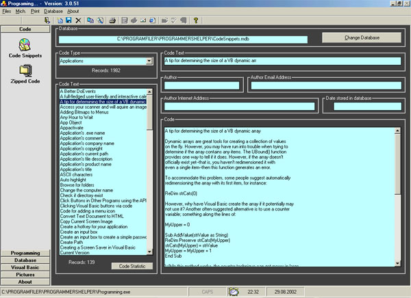



## ProgrammersHelper Ver\. 3\.55

### Description

This is an update to a previous upload.

I have corrected most of the errors some of you were kind enough to point out - and added some new futures. The code snippets database is now re-worked and includes some 2000 snippets as well as a special section, which takes care of some 500 API calls. This code is yours for the taking, do not bother to vote - but feedback is most welcome. Have a nice day
 
### More Info
 

             |
---                |---
**Submitted On**   |2002-10-23 14:42:46
**By**             |[Jorgen Levesen](https://github.com/Planet-Source-Code/PSCIndex/blob/master/ByAuthor/jorgen-levesen.md)
**Level**          |Intermediate
**User Rating**    |4.9 (153 globes from 31 users)
**Compatibility**  |VB 6\.0
**Category**       |[Complete Applications](https://github.com/Planet-Source-Code/PSCIndex/blob/master/ByCategory/complete-applications__1-27.md)
**World**          |[Visual Basic](https://github.com/Planet-Source-Code/PSCIndex/blob/master/ByWorld/visual-basic.md)
**Archive File**   |[Programmer14864510242002\.zip](https://github.com/Planet-Source-Code/jorgen-levesen-programmershelper-ver-3-55__1-40114/archive/master.zip)

